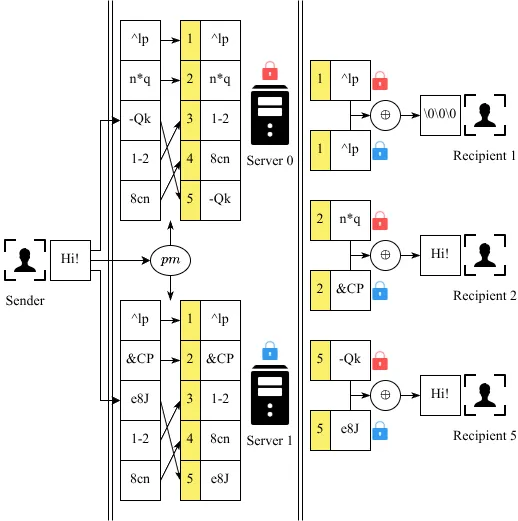

Accepted by IEEE Transactions on Information Forensics and Security (TIFS) in 2026-06.

## Abstract

End-to-end encrypted messaging systems protect data content, but metadata, such as the source and destination of encrypted data, also require protection.
Existing metadata-hiding systems primarily target unicast/broadcast.
Some support multicast but either expose the recipient group size, potentially revealing the sender’s identity, or experience reduced throughput as the recipient group size increases, making them inefficient for multicast.
Metadata-hiding multicast remains challenging, particularly when malicious clients/servers deviate from the protocol, potentially corrupting the system or deanonymizing clients.

In this paper, we present MHcast, a high-throughput metadata-hiding multicast system.
MHcast uses two distributed comparison functions with a public mapping to construct a multicast scheme.
MHcast enforces a mailbox access control scheme to prevent malicious clients from disrupting multicast through malformed or junk messages.
Additionally, MHcast provides an identification scheme that allows honest clients to assist an honest server in identifying the malicious server.
We implement and evaluate MHcast in comparison to other metadata-hiding systems.
Experiments show that MHcast’s throughput is 2–10× higher than repeatedly using the unicast protocol when the group size is only 16.
MHcast supports groups of any size, from 0 to N, where N is the total number of clients.

## Workflow Figure

An example of a multicast operation.
It shows that a sender sends "Hi!" to the recipients 2 and 5.
Indistinguishable messages are written to all mailboxes secret-shared between the two servers.
The recipients 2 and 5 can recover "Hi!" from their mailboxes.
The recipient 1 recovers a zero message.

## Full Paper

Available on [this website](/papers/mhcast_tifs.pdf).
