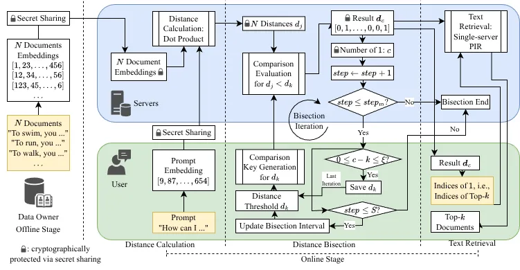

## Abstract

Retrieval-Augmented Generation (RAG) enables large language models to use external knowledge, but outsourcing the RAG service raises privacy concerns for both data owners and users.
Privacy-preserving RAG systems address these concerns by performing secure top-$k$ retrieval, which is typically implemented using secure sorting to identify relevant documents.
However, existing systems face challenges supporting arbitrary $k$ due to their inability to change $k$, new security issues, and in particular, efficiency degradation with large $k$.
This is a significant limitation because applications such as finance, law, and healthcare require a $k$ that is large enough to cause huge overhead for existing systems. Also, modern long-context models generally achieve higher accuracy with larger retrieval sets.
We propose P²RAG, an efficient privacy-preserving RAG service that supports arbitrary top-$k$ retrieval.
Unlike existing systems, P²RAG avoids sorting candidate documents.
Instead, it uses an interactive bisection method to determine the set of top-$k$ documents.
For security, P²RAG uses secret sharing on two semi-honest non-colluding servers to protect the data owner's database and the user's prompt.
It enforces restrictions and verification to defend against malicious users and tightly bounds the information leakage of the database.
The experiments show that P²RAG is 3--300$\times$ faster than the state-of-the-art PRAG for $k = 16$--$1024$.

## Workflow Figure

The workflow of P²RAG.
During the offline stage, the data owner sets up the secret-shared database.
During the distance calculation, the servers compute the secret-shared distances between each document and the user's prompt.
During the distance bisection, the user determines a distance threshold $d_k$ for the top-$k$ documents.
The bisection iteration ends when $d_k$ is found, or the number of iterations exceeds an upper bound.
During the text retrieval, the user retrieves textual documents using the indices of the top-$k$ documents.

## Full Paper

The preprint version is available on [arXiv 2603.14778](https://arxiv.org/abs/2603.14778).
